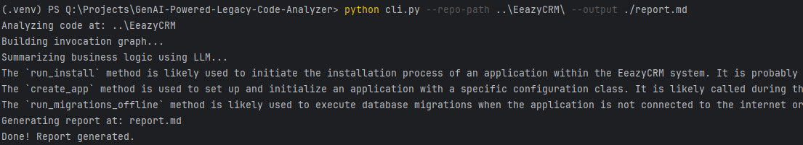

# GenAI-Powered-Legacy-Code-Analyzer

**Code Analyzer** is a command-line tool that extracts business requirements from Python codebases using static analysis and large language models (LLMs). It parses your code using the Python AST, builds a method invocation graph, analyzes context with an LLM, and produces a structured Markdown report.

---

## Features

- AST-based class and method extraction
- Method invocation graph using NetworkX
- Business logic summarization using OpenAI (via LangChain)
- Markdown report with code references
- GitHub-style links to source lines

---

## Installation

This project uses [Poetry](https://python-poetry.org/) for dependency management.

Clone the repo and install dependencies:

```bash
git clone https://github.com/KepAlex503/GenAI-Powered-Legacy-Code-Analyzer.git
cd GenAI-Powered-Legacy-Code-Analyzer
poetry install

## Runnind
poetry run cli.py --repo-path ..\RepoName\ --output ./report.md
```
Should look like that

